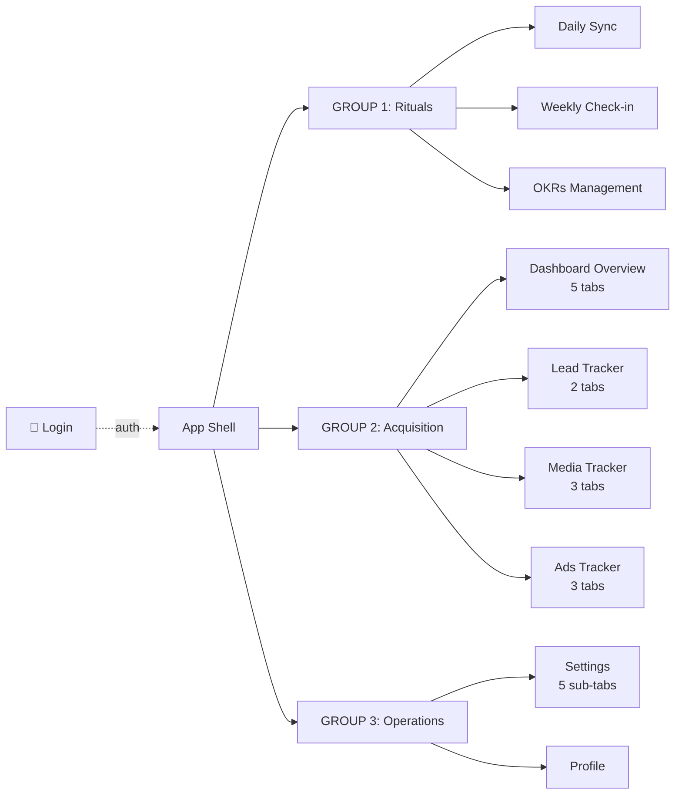

# IA Proposal — SMIT-OS v3

## Sidebar Structure (4 Groups)



## Detailed Route Table

| # | Group | Page | Route | Sub-views | Mobile critical |
|---|---|---|---|---|---|
| — | Auth | Login + 2FA | `/login` | 2-step flow | ✅ |
| 1 | Rituals | Daily Sync | `/sync/daily` | List + form | ✅ HIGH (mobile checkin) |
| 2 | Rituals | Weekly Check-in | `/sync/weekly` | Form + table | ✅ HIGH (mobile checkin) |
| 3 | Rituals | OKRs Management | `/okrs` | L1/L2 tabs + Add Objective modal | ⚠️ Tablet |
| 4 | Acquisition | Dashboard Overview | `/dashboard` | 5 tabs: Overview/Sales/Product/Marketing/Media | Desktop primary |
| 5 | Acquisition | Lead Tracker | `/leads` | 2 tabs: Logs + Stats | Desktop primary |
| 6 | Acquisition | Media Tracker | `/media` | 3 tabs: Owned/KOL/PR | Desktop primary |
| 7 | Acquisition | Ads Tracker | `/ads` | 3 tabs: Campaigns/Performance/Attribution | Desktop primary |
| 8 | Operations | Settings | `/settings` | 5 sub-tabs: Profile/Users/OKR Cycles/FB Config/Sheets Export | Desktop |
| 9 | Operations | Profile | `/profile` | Simple | Desktop |

**Total: 9 sidebar items + 1 auth route**

## Merge Decision: MediaTracker + AdsTracker

**Recommendation: KEEP SEPARATE** (not merge into "Acquisition Hub")

Rationale:
- Each tracker already has 3 sub-tabs (6 total if merged → too dense)
- Different user personas: Media = content/PR team, Ads = paid-acquisition team
- Different metrics: Media = reach/engagement, Ads = ROAS/CPC
- v2 already separates them; keep continuity unless user pushes back

## Sidebar Layout Pattern (D2 Apple Bento aesthetic)

```
┌─────────────────────┐
│  [Logo] SMIT-OS     │  ← Top: logo (32px symbol + wordmark)
├─────────────────────┤
│  🔍 Search...       │  ← Search bar
├─────────────────────┤
│  RITUALS            │  ← Group label (label-caps style, on-surface-variant)
│  📋 Daily Sync      │
│  📅 Weekly Check-in │
│  🎯 OKRs            │
├─────────────────────┤
│  ACQUISITION        │
│  📊 Dashboard       │
│  👥 Lead Tracker    │
│  📰 Media Tracker   │
│  💸 Ads Tracker     │
├─────────────────────┤
│  OPERATIONS         │
│  ⚙️  Settings       │
│  👤 Profile         │
├─────────────────────┤
│   spacer            │
├─────────────────────┤
│  [Avatar] Quân Bá   │  ← Bottom: user menu
│  Sign out           │
└─────────────────────┘
```

**Sidebar treatment** (open question for user):
- **Option A**: Light sidebar matching D2 mockup (surface-container-low #f0f3ff)
- **Option B**: Dark sidebar contrast (mockup pattern) — adds visual interest but breaks light-mode consistency
- **Recommend Option A** for accessibility + brand coherence

## Page-Level Changes vs v2

| Change | v2 | v3 proposal | Why |
|---|---|---|---|
| Sidebar grouping | Flat list 10 items | 3 groups + group labels | Cognitive load reduction |
| Sidebar treatment | Glass white/50 | Solid surface-container-low | Bento aesthetic, cleaner |
| Page titles | "Page Name" + italic accent | "Page Name" with subtle color accent (per D2 Apple style) | Stricter typography |
| Tabs | TabPill (rounded full) | Apple-style segmented control (subtle bg shift) | D2 aesthetic |
| Card style | Glass white/50 backdrop-blur | Solid white with Level 1 shadow (soft chromatic) | D2 spec |
| Modal | Centered glass | Centered solid with backdrop blur 80px | D2 Level 3 |

## Changes NOT recommended (preserve v2)

- 10-page total count (keep)
- Settings 5 sub-tabs structure (keep)
- Dashboard 5 tabs structure (keep — Overview/Sales/Product/Marketing/Media)
- LeadTracker 2 tabs (keep — Logs/Stats)
- OKRsManagement L1/L2 hierarchy (keep)

## Wireframe Plan (next step)

Generate wireframes for each unique layout pattern (not every page):

| Wireframe | Covers |
|---|---|
| WF-01 Layout Shell | All app pages (Sidebar + Header + Main) |
| WF-02 Login + 2FA | Login page (isolated) |
| WF-03 List+Detail | Daily Sync, Weekly Check-in (mobile critical) |
| WF-04 OKR Accordion | OKRs Management (L1/L2 cards) |
| WF-05 Tabbed Dashboard | Dashboard Overview (5 tabs) |
| WF-06 Tabbed Tracker | Lead Tracker, Media Tracker, Ads Tracker (similar layout) |
| WF-07 Sub-tab Settings | Settings (5 sub-tabs) |
| WF-08 Simple Form | Profile |

**8 wireframes cover all 10 pages** through pattern reuse.

## Open Questions for User

1. Merge MediaTracker + AdsTracker into single "Acquisition" page? (Recommend: NO)
2. Dark sidebar treatment per D2 mockup, or light-uniform sidebar? (Recommend: light-uniform)
3. Page titles — "italic accent" v2 pattern keep, or full D2 style? (Recommend: D2 full)
4. Sidebar group labels visible or invisible? (Recommend: visible — Apple Settings.app style)
5. Mobile sidebar — drawer (slide-in) or bottom tab bar? (Recommend: drawer for desktop-first app)

## Risks

| Risk | Severity | Mitigation |
|---|---|---|
| Group labels create visual noise | LOW | A/B test in Phase 5 |
| 9 sidebar items still too many | MEDIUM | Acceptable for SMIT-OS scale |
| Sidebar drawer mobile UX issue | MEDIUM | Test mobile gate in Phase 5 |
| Dark sidebar regression vs v2 | LOW | Option A (light) avoids |

## ✅ Sign-off LOCKED 2026-05-11

User approved all 5 decisions (recommended option each):
- [x] **3-group sidebar** (Rituals/Acquisition/Operations) + separate Auth/Login route
- [x] **Keep-separate Media + Ads** — 9 sidebar items (no merge)
- [x] **Light uniform sidebar** — surface-container-low, no dark contrast
- [x] **Visible group labels** — "RITUALS" / "ACQUISITION" / "OPERATIONS" uppercase
- [x] **D2 full Apple-style titles** — drop v2 italic accent pattern
- [x] **Mobile drawer** — hamburger slide-in (desktop-first app)
- [x] **8-wireframe plan** covers 10 pages via pattern reuse

🔒 **IA HARD FROZEN.** No structural changes allowed until v4.
